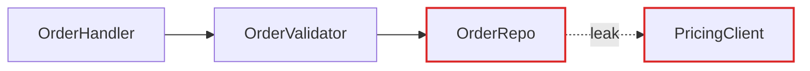
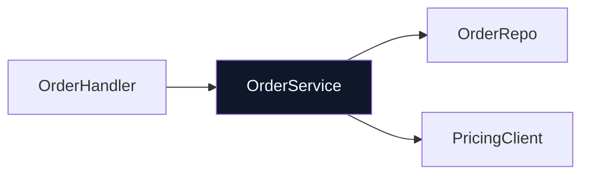

# HTML Report Format

The architectural review is rendered as a single self-contained HTML file written to `temp/` at the project root. Layout uses inline CSS — no external CSS dependencies. Mermaid is loaded from CDN for graph diagrams but is optional: `<pre class="mermaid">` elements degrade to readable code blocks if the CDN is unavailable. Hand-built divs and inline SVG handle the more editorial visuals (mass diagrams, cross-sections). Mix the two — don't lean on Mermaid for everything, it'll start to look generic.

## Scaffold

```html
<!doctype html>
<html lang="en">
  <head>
    <meta charset="utf-8" />
    <title>Architecture review — {{repo name}}</title>
    <style>
      /* Self-contained — no external CSS dependencies. */
      *, *::before, *::after { box-sizing: border-box; }
      body { font-family: system-ui, -apple-system, sans-serif; background: #fafaf9; color: #1e293b; margin: 0; }
      main { max-width: 64rem; margin: 0 auto; padding: 3rem 1.5rem; display: flex; flex-direction: column; gap: 3rem; }
      h1 { font-size: 1.5rem; font-weight: 700; margin: 0 0 0.25rem; }
      h2 { font-size: 1.125rem; font-weight: 700; margin: 0 0 1rem; }
      article { background: #fff; border: 1px solid #e2e8f0; border-radius: 0.5rem; padding: 1.5rem; display: flex; flex-direction: column; gap: 1rem; }
      .badge { display: inline-block; padding: 0.15rem 0.6rem; border-radius: 9999px; font-size: 0.7rem; font-weight: 700; text-transform: uppercase; letter-spacing: 0.06em; }
      .badge-strong      { background: #d1fae5; color: #065f46; }
      .badge-worth       { background: #fef3c7; color: #92400e; }
      .badge-speculative { background: #f1f5f9; color: #475569; }
      .badge-dep         { background: #ede9fe; color: #5b21b6; }
      .files { font-family: monospace; font-size: 0.8rem; color: #475569; }
      .diagram-grid  { display: grid; grid-template-columns: 1fr 1fr; gap: 1rem; }
      .diagram-panel { border: 1px solid #e2e8f0; border-radius: 0.375rem; padding: 0.75rem; background: #f8fafc; }
      .diagram-label { font-size: 0.65rem; text-transform: uppercase; letter-spacing: 0.08em; color: #94a3b8; margin-bottom: 0.5rem; }
      ul.wins { margin: 0; padding-left: 1.25rem; font-size: 0.875rem; }
      .adr-callout { background: #fffbeb; border: 1px solid #fde68a; border-radius: 0.375rem; padding: 0.75rem; font-size: 0.875rem; }
      .seam { stroke-dasharray: 4 4; }
      .leak { stroke: #dc2626; }
      .deep { background: linear-gradient(135deg, #0f172a, #1e293b); color: #f8fafc; }
    </style>
    <!-- Mermaid is optional: graph diagrams render if the CDN is reachable,
         <pre class="mermaid"> elements degrade to readable code blocks otherwise. -->
    <script type="module">
      import mermaid from "https://cdn.jsdelivr.net/npm/mermaid@11/dist/mermaid.esm.min.mjs";
      mermaid.initialize({ startOnLoad: true, theme: "neutral", securityLevel: "loose" });
    </script>
  </head>
  <body>
    <main>
      <header>...</header>
      <section id="candidates">...</section>
      <section id="top-recommendation">...</section>
    </main>
  </body>
</html>
```

## Header

Repo name, date, and a compact legend: solid box = module, dashed line = seam, red arrow = leakage, thick dark box = deep module. No introduction paragraph — straight into the candidates.

## Candidate card

The diagrams carry the weight. Prose is sparse, plain, and uses the glossary terms ([LANGUAGE.md](LANGUAGE.md)) without ceremony.

Each candidate is one `<article>`:

- **Title** — short, names the deepening (e.g. "Collapse the Order intake pipeline").
- **Badge row** — recommendation strength (`Strong` = emerald, `Worth exploring` = amber, `Speculative` = slate), plus a tag for the dependency category (`in-process`, `local-substitutable`, `ports & adapters`, `mock`).
- **Files** — monospaced list, `class="files"`.
- **Before / After diagram** — the centrepiece. Two columns, side by side. See patterns below.
- **Problem** — one sentence. What hurts.
- **Solution** — one sentence. What changes.
- **Wins** — bullets, ≤6 words each. e.g. "Tests hit one interface", "Pricing logic stops leaking", "Delete 4 shallow wrappers".
- **ADR callout** (if applicable) — one line in an amber-tinted box.

No paragraphs of explanation. If the diagram needs a paragraph to be understood, redraw the diagram.

## Diagram patterns

Pick the pattern that fits the candidate. Mix them. Don't make every diagram look the same — variety is part of the point.

### Mermaid graph (the workhorse for dependencies / call flow)

Use a Mermaid `flowchart` or `graph` when the point is "X calls Y calls Z, and look at the mess." Wrap it in a `diagram-panel` card so it doesn't feel parachuted in. Style with classDef to colour leakage edges red and the deep module dark. Sequence diagrams work well for "before: 6 round-trips; after: 1."

```html
<div class="diagram-panel">
  <pre class="mermaid">
    flowchart LR
      A[OrderHandler] --> B[OrderValidator]
      B --> C[OrderRepo]
      C -.leak.-> D[PricingClient]
      classDef leak stroke:#dc2626,stroke-width:2px;
      class C,D leak
  </pre>
</div>
```

### Hand-built boxes-and-arrows (when Mermaid's layout fights you)

Modules as `<div>`s with borders and labels. Arrows as inline SVG `<line>` or `<path>` elements positioned absolutely over a relative container. Reach for this when you want the "after" diagram to feel like one thick-bordered deep module with greyed-out internals — Mermaid won't render that with the right weight.

### Cross-section (good for layered shallowness)

Stack horizontal bands (e.g. `style="height:3rem; border-left:4px solid #6366f1; padding-left:0.75rem"`) to show layers a call passes through. Before: 6 thin layers each doing nothing. After: 1 thick band labelled with the consolidated responsibility.

### Mass diagram (good for "interface as wide as implementation")

Two rectangles per module — one for interface surface area, one for implementation. Before: interface rectangle is nearly as tall as the implementation rectangle (shallow). After: interface rectangle is short, implementation rectangle is tall (deep).

### Call-graph collapse

Before: a tree of function calls rendered as nested boxes. After: the same tree collapsed into one box, with the now-internal calls shown faded inside it.

## Style guidance

- Lean editorial, not corporate-dashboard. Generous whitespace. Serif optional for headings — add `font-family: Georgia, serif` to `h1, h2` in the `<style>` block.
- Colour sparingly: one accent (emerald or indigo) plus red for leakage and amber for warnings.
- Keep diagrams ~320px tall so before/after sits comfortably side by side without scrolling.
- Use `class="diagram-label"` for module labels inside diagrams — they should read as schematic, not as UI.
- The only script is the optional Mermaid ESM import. The report is otherwise static — no app code, no interactivity beyond Mermaid's own rendering.

## Top recommendation section

One larger card. Candidate name, one sentence on why, anchor link to its card. That's it.

## Companion Markdown file

Generate this alongside the HTML report. It contains only the Mermaid diagrams — one before/after pair per candidate. Users open it in VS Code Markdown Preview with a Mermaid extension for native rendering without CDN.

````markdown
# Architecture review — {{repo name}} — {{date}}

> Mermaid diagrams only — open in VS Code Markdown Preview for native rendering.
> Full styled report: `architecture-review-{{timestamp}}.html`

---

## {{Candidate title}}

**Before**



**After**



---

## {{Next candidate title}}

...
````

Keep the `.md` file minimal — diagrams and candidate titles only. All prose, badges, and wins belong in the HTML report.

## Tone

Plain English, concise — but the architectural nouns and verbs come straight from [LANGUAGE.md](LANGUAGE.md). Concision is not an excuse to drift.

**Use exactly:** module, interface, implementation, depth, deep, shallow, seam, adapter, leverage, locality.

**Never substitute:** component, service, unit (for module) · API, signature (for interface) · boundary (for seam) · layer, wrapper (for module, when you mean module).

**Phrasings that fit the style:**

- "Order intake module is shallow — interface nearly matches the implementation."
- "Pricing leaks across the seam."
- "Deepen: one interface, one place to test."
- "Two adapters justify the seam: HTTP in prod, in-memory in tests."

**Wins bullets** name the gain in glossary terms: *"locality: bugs concentrate in one module"*, *"leverage: one interface, N call sites"*, *"interface shrinks; implementation absorbs the wrappers"*. Don't write *"easier to maintain"* or *"cleaner code"* — those terms aren't in the glossary and don't earn their place.

No hedging, no throat-clearing, no "it's worth noting that…". If a sentence could be a bullet, make it a bullet. If a bullet could be cut, cut it. If a term isn't in [LANGUAGE.md](LANGUAGE.md), reach for one that is before inventing a new one.
